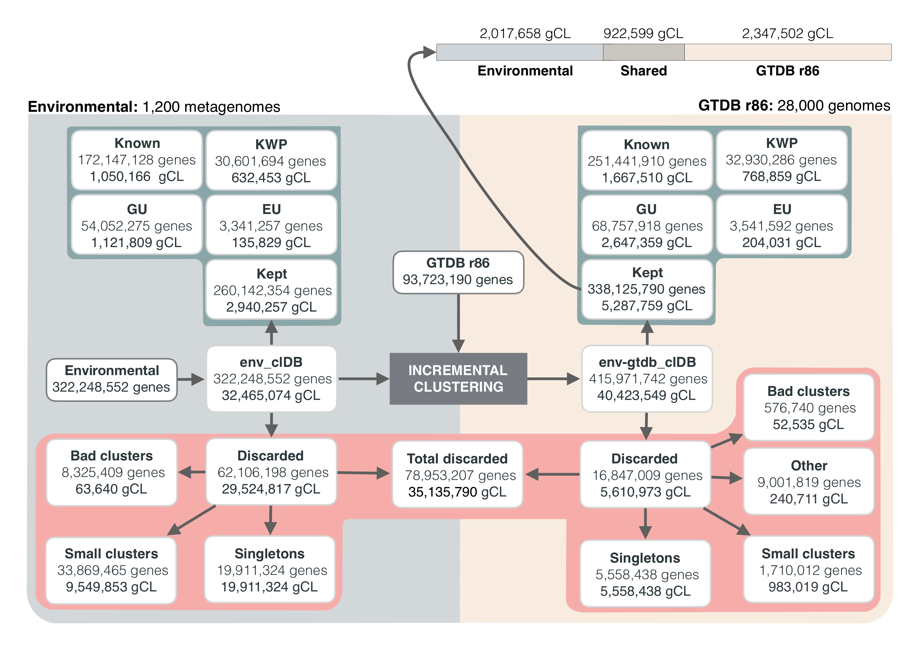
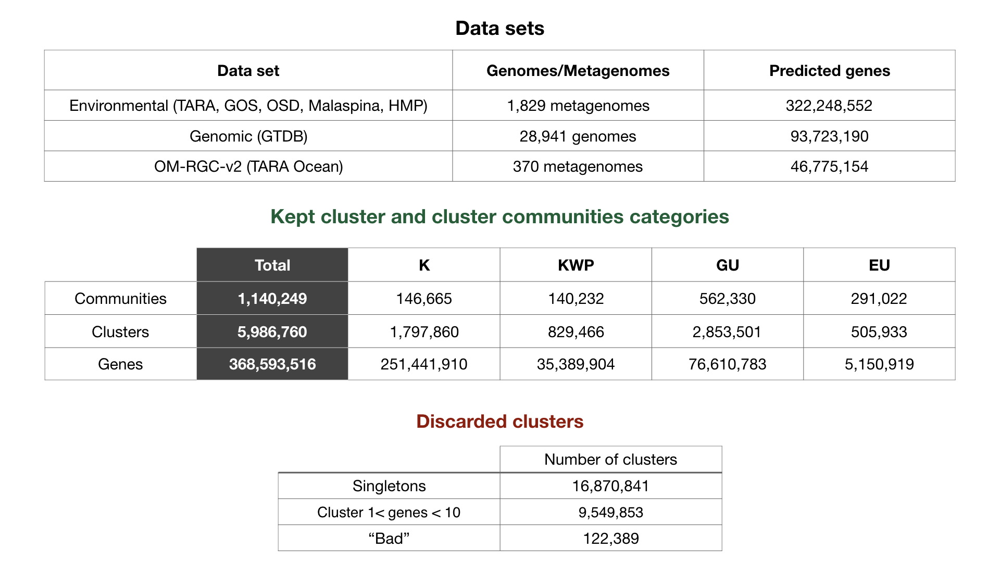

## AgnostosDB data structure

#### agnostosDB/

-   cluster_ids_categ.tsv - Table with cluster ids and categories.
-   cluster_ids_categ_genes.tsv.gz - Table with cluster ids and categories and genes (ORFs-headers).
-   cluster_db_size_categ_origin.tsv.gz - Table with cluster ids the sequence original database/provenience, the cluster size and the cluster categories (ORFs-headers).
-   cluster_category_summary_stats.tsv - A summary table with the refined cluster statistics. It includes cluster size, ORF length stats, cluster ORF completeness stats, HQ clusters, cluster level of darkness and disorder, and taxonomic info (prevalent taxonomy and taxonomic entropy).
-   HQ_clusters.tsv - set of high quality (HQ) clusters (clusters with high percentage of complete ORFs). Fields: cluster name, category.
-   cluster_communities.tsv - Table containing the correspondence between cluster and cluster communitites. Fields: cluster name, community name, category.
-   pfam_name_acc_clan_multi.tsv - All genes Pfam multi-domain annotations. Fields: orf, Pfam_name, Pfam_accession, Pfam_clan.
-   cluster_pfam_domain_architectures.tsv.gz - Cluster consensus Pfam domain architectures.
-   K/KWP/GU_annotations.tsv.gz - Clusters annotations (Pfam, Uniref90, NCBI nr and Uniclust).
-   spurious_shadow_info.tsv - Table containing information about spurious and shadow ORFs for each cluster. Fields: orf, length, cl_name, size, proportion of shadow per cluster, is.shadow, is.spurious.

 

-   **mmseqs_clustering/**
        -   seqDB (seqDB.dbtype, seqDB.index, seqDB.lookup, seqDB_h, seqDB_h.index) - MG+GTDB MMseqs sequence database.
        -   cluDB (cluDB.index) -  MG+GTDB MMseqs cluster database.
        -   cluDB_name_rep_size.tsv - MG+GTDB cluster name, representative and size.
-   **cluster_category_DB/**
        -   clu_hmm_db (clu_hmm_db.index, clu_hmm_db.dbtype, clu_hmm_db_h, clu_hmm_db_h.dbtype, clu_hmm_db_h.index) - Cluster HMMs profile database in MMseqs format. This is the target database to use to perform profile searches against the MG+GTDB clusterDB.
        -   clu_seqDB (clu_seqDB.index, clu_seqDB.dbtype) - Refined cluster sequence database, MMseqs format.

 
Additional metadata (not required for the workflow)

-   **environmental/**
    -   mg_cluster_sample_norfs_coverage.tsv.gz - Metagenomic cluster contextual data table, with cluster name, sample_ID, number of ORFs and coverage for each sample.
    -   niche_breadth/
        -   gCL_nb_all.Rda, gClCo_nb_all.Rda - R object containing two lists with all niche breadth values.
        -   gCl_nb_all_mv.Rda, gClCo_nb_all_mv.Rda - R object containing two tables with the mean values.
-   **phylogenetic/**
    -   gtdb_cluster_genome_norfs.tsv.gz - Genomic clusters contextual data table, with cluster name, genome accession (GTDB) and number of ORFs
    -   mg_gtdb_lineage_specific_clusters.tsv.gz - Lineage specific clusters.
    -   mg_gtdb_lineage_specific_communities.tsv.gz - Lineage specific clusters communitites.

#### AgnostosDB numbers overview

## AgnostosDB + OM-RGC-v2 data structure

#### agnostosDB_omrgcv2/

-   cluster_ids_categ.tsv - Table with cluster ids and categories.
-   cluster_ids_categ_genes.tsv.gz - Table with cluster ids and categories and genes (ORFs-headers).
-   cluster_db_size_categ.tsv.gz - Table with cluster ids the sequence original database/provenience, the cluster size and the cluster categories (ORFs-headers).
-   cluster_category_summary_stats.tsv - A summary table with the refined cluster statistics. It includes cluster size, ORF length stats, cluster ORF completeness stats, HQ clusters, cluster level of darkness and disorder, and taxonomic info (prevalent taxonomy and taxonomic entropy).
-   HQ_clusters.tsv - set of high quality (HQ) clusters (clusters with high percentage of complete ORFs). Fields: cluster name, category.
-   cluster_communities.tsv - Table containing the correspondence between cluster and cluster communitites. Fields: cluster name, community name, category.
-   pfam_name_acc_clan_multi.tsv - All genes Pfam multi-domain annotations. Fields: orf, Pfam_name, Pfam_accession, Pfam_clan.
-   cluster_pfam_domain_architectures.tsv.gz - Cluster consensus Pfam domain architectures.
-   K/KWP/GU_annotations.tsv.gz - Clusters annotations (Pfam, Uniref90, NCBI nr and Uniclust).
-   spurious_shadow_info.tsv - Table containing information about spurious and shadow ORFs for each cluster. Fields: orf, length, cl_name, size, proportion of shadow per cluster, is.shadow, is.spurious.

 

-   **mmseqs_clustering/**
        -   seqDB (seqDB.dbtype, seqDB.index, seqDB.lookup, seqDB_h, seqDB_h.index) - MG+GTDB+OM-RGC-v2 MMseqs sequence database.
        -   cluDB (cluDB.index) -  MG+GTDB+OM-RGC-v2 MMseqs cluster database.
        -   cluDB_name_rep_size.tsv - MG+GTDB+OM-RGC-v2 cluster name, representative and size.
-   **cluster_category_DB/**
        -   clu_hmm_db (clu_hmm_db.index, clu_hmm_db.dbtype, clu_hmm_db_h, clu_hmm_db_h.dbtype, clu_hmm_db_h.index) - Cluster HMMs profile database in MMseqs format. This is the target database to use to perform profile searches against the MG+GTDB+OM-RGC-v2 clusterDB.
        -   clu_seqDB (clu_seqDB.index, clu_seqDB.dbtype) - Refined cluster sequence database, MMseqs format.

 
Additional metadata (not required for the workflow)

-   **environmental/**
    -   mg_cluster_sample_norfs_coverage.tsv.gz - Metagenomic cluster contextual data table, with cluster name, sample_ID, number of ORFs and coverage for each sample.
    -   niche_breadth/
        -   gCL_nb_all.Rda, gClCo_nb_all.Rda - R object containing two lists with all niche breadth values.
        -   gCl_nb_all_mv.Rda, gClCo_nb_all_mv.Rda - R object containing two tables with the mean values.
-   **phylogenetic/**
    -   gtdb_cluster_genome_norfs.tsv.gz - Genomic clusters contextual data table, with cluster name, genome accession (GTDB) and number of ORFs
    -   mg_gtdb_lineage_specific_clusters.tsv.gz - Lineage specific clusters.
    -   mg_gtdb_lineage_specific_communities.tsv.gz - Lineage specific clusters communitites.

-   **TARA_OM-RGC-v2/**
    -   OM-RGC_v2_all_genes_class_categ_pairs.tsv.gz - Coexpression pairs table.
    -   OM-RGC_v2_genes_class_categ.tsv.gz - TARA OM-RGC-v2 classification in known and unknown genes in comparison with our annotation in the four categories.

#### AgnostosDB + OM-RGC-v2 numbers overview

